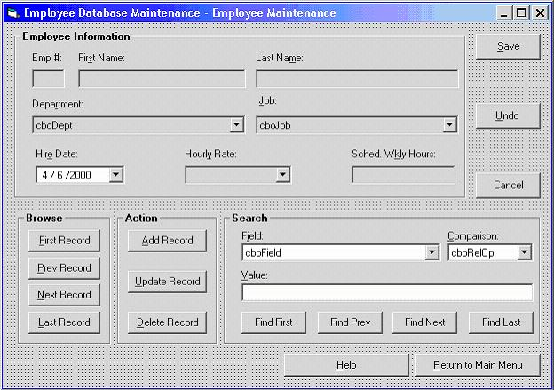



## Process Access DB using DAO

### Description

This tutorial / demo app shows you how to process an Access database using "old school" DAO (Data Access Objects) code. Covered in the tutorial is the DAO Object Model, as well as methods for recordset processing, searching, inserting, updating, deleting, etc. The sample app also uses Crystal Reports (the version that came with VB6 and VB5, not a commercial version). The Employee.mdb file that is part of this sample app is Access 97 format, and it MUST be 97 as the old version of Crystal cannot read anything higher. (If you have Access 200X, the higher version of Access will be able to read this database, but don't accept any of its offers to convert it for you.)
 
### More Info
 

             |
---                |---
**Submitted On**   |2006-09-21 07:35:06
**By**             |[TheVBPro](https://github.com/Planet-Source-Code/PSCIndex/blob/master/ByAuthor/thevbpro.md)
**Level**          |Intermediate
**User Rating**    |5.0 (10 globes from 2 users)
**Compatibility**  |VB 6\.0
**Category**       |[Databases/ Data Access/ DAO/ ADO](https://github.com/Planet-Source-Code/PSCIndex/blob/master/ByCategory/databases-data-access-dao-ado__1-6.md)
**World**          |[Visual Basic](https://github.com/Planet-Source-Code/PSCIndex/blob/master/ByWorld/visual-basic.md)
**Archive File**   |[Process\_Ac2021099212006\.zip](https://github.com/Planet-Source-Code/thevbpro-process-access-db-using-dao__1-66618/archive/master.zip)

